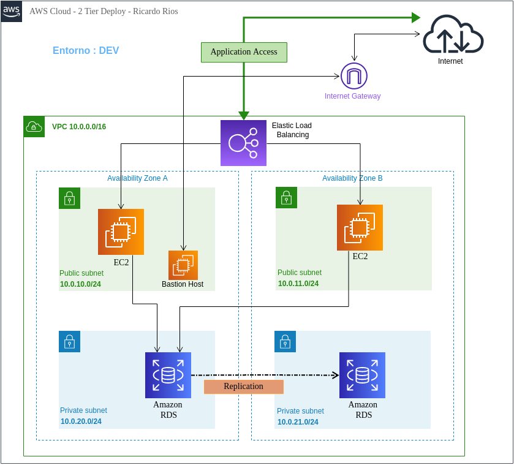
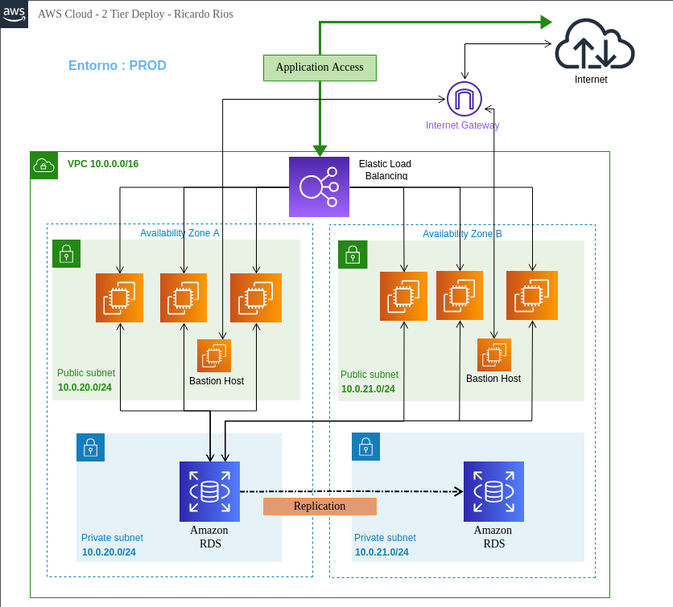
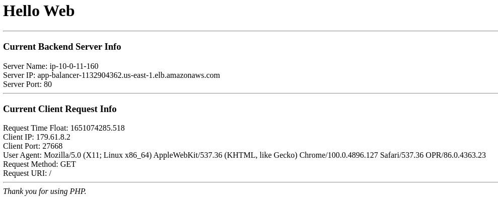

# Infraestructura 2 Tier para AWS

[](https://www.terraform.io)
[](LICENSE)

# Aviso
Este es mi primer repositorio y segundo proyecto para el despliegue de infraestructura con Terraform durante mi proceso de aprendizaje, lo hice meramente para aprender y NO DEBERÍA USARSE EN PRODUCCIÓN.

# Descripción
Este repositorio provee el template para correr una web y su respectiva base de datos en 2 zonas de disponibilidad de Amazon, también se utiliza ELS (Elastic Load Balancer) para estos servidores web, otorgando redundancia multi zona.

### Infraestructura de Desarrollo
<p align="center">
  
</p>

### Infraestructura de Produccion
<p align="center">
  
</p>


También permite cambiar los parámetros iniciales, cantidad de servidores webs y servidores "bastion" según el entorno a utilizar: desarrollo, producción, qa o state.

# Configuración
Por defecto, está configurado con entorno "DEV", lo que genera 2 servidores Web y 1 servidor Bastion, a diferencia del entorno "PROD" que tiene 4 servidores webs y 2 servidores bastion (uno en cada az), estos valores se pueden cambiar, pero existe una limitación en Amazon de cantidad de EIPs que debe ajustarse antes o dará error.

### environment.tf :
```tf
variable "deploy_environment" {
  default = "DEV"
}
```


### provider.tf
La configuracion de region esta por defecto en us-east-1

```tf
provider "aws" {
  profile = "default"
  region  = "us-east-1"
}
```


### variables.tf:

El acceso SSH a cada servidor se hace por medio de usuario/contraseña, creado por el script de cloud-init.

```tf
variable "username" {
  type    = string
  default = "admin"
}
```
```tf
variable "passwd" {
  type    = string
  default = "$6$rounds=4096$nykXA.RenSsIntnK$T.cI4wKWXZ4V4n2gqr4GsYjB0.uQQtkdb3ixNCXVR2iulknHSGDRWJ4N3EDfs.YNYHkrMJtOKULOPU/NH8BGJ1"
}
```

La clave en este ejemplo es "changemeplz", se puede generar una nueva usando :  ``` mkpasswd --method=SHA-512 --rounds=4096 ```

# Despliegue

Una vez enviado el comando a Terraform de aplicar dicha infraestructura, la salida Output entrega los siguientes valores :

* __elb-address :__ Dirección DNS del ELB, el cual podemos utilizar para comprobar que funciona correctamente el despliegue Web.
* __bast-server-id :__ IDs de cada servidor Bastion
* __bast-server-private-ip :__ IP Privadas de cada servidor Bastion
* __bast-server-public-ip :__ IP Públicas de cada servidor Bastion, necesario para acceder al resto en la red Privada.
* __web-server-ids :__ IDs de cada servidor web
* __web-server-private-ip :__ IP Privadas de cada servidor Web
* __web-server-public-ip :__ IP Públicas de cada servidor Web
* __db-master-endpoint :__ Nombre DNS del servidor Principal de Base de Datos.
* __db-slave-endpoint :__ Nombre DNS del servidor Replica de Base de Datos.

### Ejemplo al ingresar a la dirección del ELB
Hacer refresh en esta pagina deberia mostrar las diferentes IP Internas de los servidores web.

<p align="center">
  
</p>

### Problemas conocidos al desplieguar

- Es probable que se tenga que ejecutar ```terraform apply``` 2 veces, por alguna razón que desconozco, las EIPs (Elastic IP Address) no cargan correctamente en el ELB (Elastic Load Balancer) en el primer apply, si alguien sabe porque, le agradeceria me dijera para solucionarlo ;)
- Las Base de datos (RDS) tanto la Principal como la Réplica, demoran en total, entre 15 o 20 minutos en desplegar, desconozco si esto es normal o no.

# Características a mejorar.

- Agregar capacidad de Auto Scaling.
- Cambiar configuración de Elastic (Classic) Load Balancer (ELB) a Application Load Balancer (ALB).
- Agregar capacidad HTTPS al Load Balancer.
- Realizar configuración básica DNS con Route 53.
- Reglas de security_group mas granulares y restrictivas sólo a las IPs necesarias.

# Licencia

[](LICENSE)
